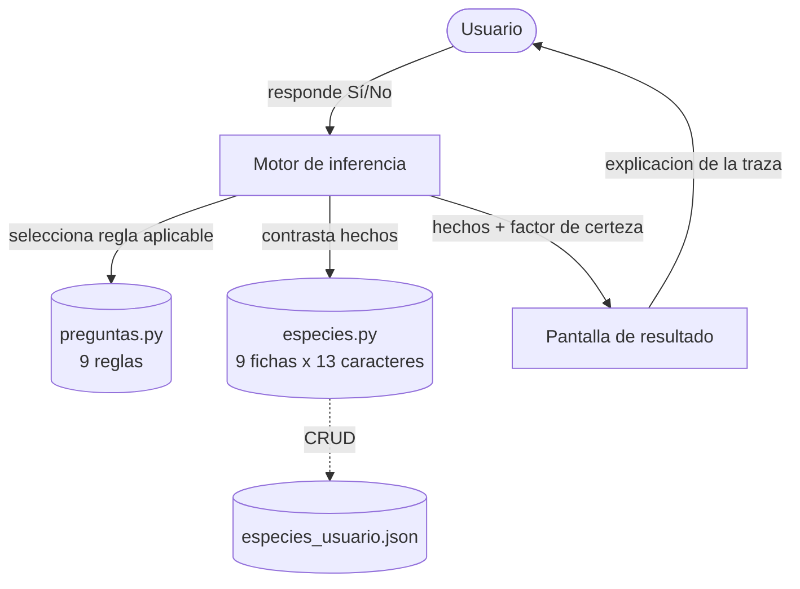

# 🦀 SEDIO — Sistema Experto para la Identificación Taxonómica de Cangrejos Ermitaños (Familia Diogenidae)

**Identificación morfológica asistida de las nueve especies de la familia Diogenidae
(Crustacea: Decapoda: Anomura) registradas en el litoral de la Península de Macanao,
Isla de Margarita, estado Nueva Esparta, Venezuela (mar Caribe).**

Asignatura: **Sistemas Expertos** · Universidad de Oriente
Repositorio oficial: <https://github.com/Bioinformatico-udo/Sistemas-Experto-I2026>

---

## 1. Integrantes del Grupo

> ⚠️ **Completar antes de la entrega** con nombres y apellidos completos.

| # | Nombres y apellidos completos | Cédula | Rol principal en el proyecto |
|---|-------------------------------|--------|------------------------------|
| 1 | _(completar)_ | _(completar)_ | Base de conocimientos / curaduría taxonómica |
| 2 | _(completar)_ | _(completar)_ | Motor de inferencia |
| 3 | _(completar)_ | _(completar)_ | Interfaz gráfica (PyQt6) |
| 4 | _(completar)_ | _(completar)_ | Documentación y pruebas |

**Grupo N.º:** _(completar)_ · **Carpeta en el repositorio:** `GrupoN/sistema_experto_diogenidae/`

---

## 2. Descripción General

### 2.1 El problema

La identificación taxonómica de cangrejos ermitaños exige experiencia acumulada. Las
nueve especies de Diogenidae presentes en Macanao se distinguen por caracteres
morfológicos finos —presencia de pleópodos pareados en el primer somito abdominal,
longitud relativa de las setas del flagelo antenal, simetría de los quelípedos, forma
del ápice de los dedos, ornamentación del caparazón— que requieren lupa o
estereomicroscopio y, sobre todo, saber **en qué orden** examinarlos. Quien no tiene
ese entrenamiento se enfrenta a claves dicotómicas impresas de terminología densa, en
las que un error en un nodo temprano arrastra el diagnóstico completo hacia una rama
equivocada sin ninguna señal de alarma.

### 2.2 El dominio de conocimiento

El dominio es acotado y bien delimitado, condición ideal para un sistema experto:

- **9 especies** de 6 géneros: *Paguristes* (2), *Clibanarius* (3), *Isocheles* (1),
  *Petrochirus* (1), *Calcinus* (1) y *Dardanus* (1).
- **13 caracteres morfológicos** booleanos, de los cuales **9 son interrogables** por
  el sistema y 4 se conservan como información de respaldo en la ficha de cada especie.
- Datos ecológicos asociados: talla (longitud y ancho del escudo cefalotorácico, en
  mm), sustratos, intervalo batimétrico, estaciones de muestreo y distribución
  geográfica.

El conocimiento se formalizó a partir de la clave dicotómica de Provenzano (1959) para
los ermitaños de aguas someras del Atlántico occidental, en la adaptación regional para
la Península de Macanao de Lira (1997), y la nomenclatura se validó contra el registro
vigente de WoRMS/DecaNet.

### 2.3 Utilidad

- **Docente:** apoyo en prácticas de Zoología de Invertebrados y Carcinología. El
  sistema no solo responde: explica *por qué* pregunta cada carácter.
- **Investigación:** agiliza la clasificación preliminar de material de campo y reduce
  la dependencia de un especialista para determinaciones rutinarias.
- **Preservación del conocimiento:** codifica de forma explícita y auditable un saber
  que hoy reside en literatura gris de difícil acceso.
- **Extensibilidad:** el usuario incorpora especies nuevas sin tocar el código,
  mediante formulario o importación de archivos JSON.

---

## 3. Arquitectura del Sistema

### 3.1 Visión general

El sistema sigue la arquitectura clásica de tres componentes desacoplados: la interfaz
nunca razona y el motor nunca sabe cómo se dibuja una pantalla.

```
┌──────────────────────────────────────────────────────────────────┐
│                      INTERFAZ DE USUARIO (ui/)                   │
│   PantallaInicio · PreguntaWidget · ResultadoWidget              │
│   CatalogoWidget · DialogoAgregarEspecie                         │
└───────────────┬──────────────────────────────────┬───────────────┘
                │ respuesta (id, True/False)       │ hechos + FC
                ▼                                  ▲
┌──────────────────────────────────────────────────────────────────┐
│              MOTOR DE INFERENCIA (motor/inferencia.py)           │
│  ┌────────────────────────┐      ┌────────────────────────────┐  │
│  │  MEMORIA DE TRABAJO    │      │  CICLO DE RECONOCIMIENTO-  │  │
│  │  self.observaciones    │◄────►│  ACCIÓN (forward chaining) │  │
│  │  {carácter: booleano}  │      │  + cálculo del FC          │  │
│  └────────────────────────┘      └────────────────────────────┘  │
└───────────────┬──────────────────────────────────┬───────────────┘
                │ consulta reglas                  │ contrasta hechos
                ▼                                  ▼
┌──────────────────────────────────────────────────────────────────┐
│                 BASE DE CONOCIMIENTOS (modelo/)                  │
│   preguntas.py → 9 reglas con precondición (`aplicaCuando`)      │
│   especies.py  → 9 fichas × 13 caracteres + datos ecológicos     │
│   especies_usuario.json → especies añadidas por el usuario       │
└──────────────────────────────────────────────────────────────────┘
```



### 3.2 Base de Conocimientos

#### a) Hechos

Un **hecho** es un par `carácter: booleano` aportado por el usuario al observar el
ejemplar. La memoria de trabajo es un diccionario, y la lista `ordenRespuestas`
conserva la secuencia, lo que permite deshacer la última respuesta sin perder
coherencia:

```python
observaciones = {
    "pleopodosPrimerSomito": False,
    "quelipedosIguales": False,
    "quelipedoDerechoLigeramenteMayor": False,
    "quelipedoLiso": True,
}
```

#### b) Reglas

Cada regla (`modelo/preguntas.py`) es un diccionario con una **precondición
ejecutable** en el campo `aplicaCuando`, que decide si la regla es aplicable dado el
estado actual de la memoria de trabajo. Es la traducción directa de un nodo de la clave
dicotómica:

```python
{
    "id": "quelipedoLiso",
    "texto": "¿El quelípedo izquierdo (mayor) es LISO, sin setas...?",
    "explicacion": "→ LISO + ápice calcáreo: Calcinus tibicen\n"
                   "→ Con HACES DE SETAS + ápice córneo: Dardanus fucosus",
    "opciones": [("Sí, liso...", True), ("No, con haces de setas...", False)],
    "aplicaCuando": lambda obs: obs.get("quelipedoDerechoLigeramenteMayor") is False
                                and obs.get("quelipedosIguales") is False,
}
```

Equivale a la regla de producción:

> **SI** los quelípedos son desiguales **Y** el derecho no es el mayor
> **ENTONCES** preguntar por la ornamentación del quelípedo izquierdo.

#### c) Matriz de caracteres

Cada especie declara los 13 caracteres. `V` = verdadero/presente, `F` = falso/ausente.

| Especie | P1 | FS | QI | QIz | DC | CR | DP | BL | BT | QD | QIM | QL | HS |
|---|---|---|---|---|---|---|---|---|---|---|---|---|---|
| *Paguristes angustitheca* | V | V | V | F | V | F | F | F | F | F | F | F | F |
| *Paguristes perplexus* | V | F | V | F | V | F | F | F | F | F | F | F | F |
| *Isocheles wurdemanni* | F | V | V | V | F | V | F | F | F | F | F | F | F |
| *Clibanarius cubensis* | F | F | V | F | V | F | V | V | F | F | F | F | F |
| *Clibanarius antillensis* | F | F | V | F | V | F | F | V | F | F | F | F | F |
| *Clibanarius tricolor* | F | F | V | F | V | F | F | F | V | F | F | F | F |
| *Petrochirus diogenes* | F | F | F | F | F | F | F | F | F | V | F | F | F |
| *Calcinus tibicen* | F | F | F | V | F | F | F | F | F | F | V | V | F |
| *Dardanus fucosus* | F | F | F | V | F | F | F | F | F | F | V | F | V |

| Clave | Carácter | ¿Interrogable? |
|-------|----------|----------------|
| P1 | Pleópodos pareados en el primer somito abdominal | Sí (regla 1) |
| FS | Setas del flagelo antenal > 6× la longitud de un artejo | Sí (regla 2) |
| QI | Quelípedos iguales o subiguales | Sí (regla 3) |
| QIz | Quelípedo izquierdo mayor | No (respaldo) |
| DC | Ápice de los dedos en forma de cuchara | Sí (regla 4) |
| CR | Caparazón posterior reticulado (celdas calcificadas) | Sí (regla 5) |
| DP | Dactilo más largo que el propodo (1.º y 2.º par) | Sí (regla 6) |
| BL | Bandas longitudinales claras en patas caminadoras | No (respaldo) |
| BT | Bandas transversas rojas y lunares en patas | Sí (regla 7) |
| QD | Quelípedo derecho ligeramente mayor | Sí (regla 8) |
| QIM | Quelípedo izquierdo mucho mayor | No (respaldo) |
| QL | Quelípedo izquierdo liso, sin setas exteriores | Sí (regla 9) |
| HS | Haces de setas sobre la palma del quelípedo | No (respaldo) |

#### d) Estructura de una ficha de especie

```python
"Calcinus tibicen": {
    "autor": "(Herbst, 1791)",
    "genero": "Calcinus",
    "imagen": "recursos/Calcinus tibicen/Calcinus tibicen.jpg",
    "caracteres": { ... 13 caracteres booleanos ... },
    "tallaMm": {"LE_min": 1.00, "LE_max": 9.00, "AE_min": 0.85, "AE_max": 7.40},
    "sustratos": ["sustrato rocoso", "coral muerto", "praderas de Thalassia",
                  "coral de fuego (Millepora)"],
    "profundidadM": (0.0, 2.0),
    "estaciones": ["E5", "E7", "E9", "E10", "E11", "E12", "E13"],
    "distribucion": "Florida, Bahamas, Antillas, Venezuela, Brasil",
    "descripcion": "...",
    "notaIdentificacion": "Quelípedo izquierdo LISO + ápice calcáreo.",
}
```

`LE` = longitud del escudo cefalotorácico; `AE` = ancho del escudo.

### 3.3 Motor de Inferencia

#### a) Estrategia: encadenamiento hacia adelante

El motor implementa **encadenamiento hacia adelante** (*forward chaining*) mediante un
ciclo de reconocimiento-acción:

1. **Reconocimiento** — `siguientePregunta()` recorre las reglas en orden y devuelve la
   primera que (a) no ha sido respondida y (b) cuya precondición `aplicaCuando` se
   satisface con los hechos actuales.
2. **Acción** — la regla se dispara solicitando el carácter al usuario;
   `registrarRespuesta()` incorpora el hecho nuevo a la memoria de trabajo.
3. **Iteración** — el ciclo se repite. Cada hecho nuevo habilita o bloquea reglas
   posteriores, de modo que el sistema **nunca pregunta por un carácter irrelevante**
   para la rama en curso: una identificación se resuelve en 2 a 5 preguntas, no en 9.
4. **Terminación** — cuando ninguna regla es aplicable, `diagnosticoCompleto()` devuelve
   `True` y se pasa a la evaluación de candidatos.

La elección del encadenamiento hacia adelante responde a la naturaleza del problema: se
parte de observaciones (datos) hacia una conclusión, sin hipótesis previa sobre la
especie. Un encadenamiento hacia atrás obligaría a plantear "¿es *Calcinus tibicen*?" y
verificar sus caracteres, recorriendo en el peor caso las nueve especies.

#### b) Manejo de incertidumbre: factor de certeza

Al terminar el interrogatorio, `inferir()` calcula para cada especie un **factor de
certeza (FC)**: el porcentaje de caracteres **observados** que coinciden con la ficha.

```
FC = (caracteres observados que coinciden / caracteres observados comparables) × 100
```

El denominador son únicamente los caracteres que el usuario ya respondió, de modo que
el FC resulta comparable entre especies y no depende de cuántos caracteres declare cada
ficha. La evaluación **no elimina** candidatos: todas las especies con FC > 0 se
conservan y se ordenan de mayor a menor, produciendo un **diagnóstico diferencial** en
lugar de una respuesta única, y permitiendo al usuario ver qué especies quedaron cerca.

| FC de la especie mejor ubicada | Categoría reportada |
|-------------------------------|---------------------|
| 100 % | IDENTIFICACIÓN DEFINITIVA |
| 70 – 99 % | IDENTIFICACIÓN PROBABLE — hay caracteres en conflicto |
| < 70 % | IDENTIFICACIÓN TENTATIVA — hay caracteres en conflicto |

Un FC inferior a 100 % significa que **ninguna** especie de la base es totalmente
consistente con lo observado: hay un error de observación, o el ejemplar pertenece a una
especie no catalogada. El método `conflictos()` devuelve la lista exacta de caracteres
que contradicen a una especie dada, lo que hace el diagnóstico auditable.

#### c) Explicación y reversibilidad

- Cada regla lleva un campo `explicacion` que justifica el carácter solicitado y
  anticipa a qué taxón conduce cada respuesta: el sistema es transparente, no una caja
  negra.
- `deshacerUltimaRespuesta()` retira el último hecho de la memoria de trabajo y
  reconstruye el estado anterior, permitiendo corregir una observación dudosa sin
  reiniciar la consulta.

### 3.4 Interfaz

Interfaz gráfica de escritorio construida con **PyQt6** (tema oscuro de inspiración
marina), organizada en un `QStackedWidget` de tres pantallas —inicio, diagnóstico y
catálogo— más un diálogo modal para la gestión de especies.

---

## 4. Instalación y Configuración

### 4.1 Prerrequisitos

| Requisito | Versión | Observación |
|-----------|---------|-------------|
| Python | 3.10 o superior | Probado en Python 3.13 |
| PyQt6 | ≥ 6.4 | Única dependencia externa |
| Sistema operativo | Windows, Linux o macOS | PyQt6 es multiplataforma |
| Espacio en disco | ≈ 5 MB | Incluye las imágenes de referencia |

### 4.2 Instalación paso a paso

**1. Clonar el repositorio**

```bash
git clone https://github.com/Bioinformatico-udo/Sistemas-Experto-I2026.git
cd Sistemas-Experto-I2026/GrupoN/sistema_experto_diogenidae
```

**2. Crear y activar un entorno virtual** (recomendado)

```bash
# Linux / macOS
python3 -m venv .venv
source .venv/bin/activate

# Windows (PowerShell)
python -m venv .venv
.\.venv\Scripts\Activate.ps1
```

**3. Instalar las dependencias**

```bash
pip install -r requerimientos.txt
```

**4. Verificar la instalación**

```bash
python -c "import PyQt6; print('PyQt6 instalado correctamente')"
```

**5. Ejecutar la aplicación**

```bash
python main.py
```

### 4.3 Solución de problemas frecuentes

| Síntoma | Causa | Solución |
|---------|-------|----------|
| `ModuleNotFoundError: No module named 'PyQt6'` | Dependencia no instalada o entorno virtual inactivo | Reactivar el entorno y ejecutar `pip install PyQt6` |
| `qt.qpa.plugin: could not load the Qt platform plugin "xcb"` | Faltan librerías gráficas del sistema (Linux) | `sudo apt install libxcb-cursor0 libxkbcommon-x11-0` |
| Las imágenes no se muestran | La carpeta `recursos/` no se copió completa | Verificar que `recursos/` acompañe a `main.py` |

---

## 5. Guía de Uso

### 5.1 Pantalla de inicio

Presenta el alcance del sistema y un botón para comenzar. Se accede en cualquier momento
con el botón **Diagnóstico** de la barra superior.

### 5.2 Realizar un diagnóstico

1. Pulsar **Iniciar diagnóstico**.
2. El sistema formula una pregunta sobre un carácter morfológico concreto, acompañada de:
   - una **explicación** de cómo observar el carácter y a qué taxón conduce cada
     respuesta;
   - una **indicación de la estructura** que debe examinarse;
   - el **historial** de respuestas ya registradas.
3. Responder con los botones **Sí** / **No** (o las teclas `1` y `2`).
4. Si una respuesta fue dudosa, `Backspace` retrocede al carácter anterior.
5. Tras 2 a 5 preguntas el sistema presenta el resultado: especie determinada, categoría
   de confianza, ficha completa (autor, talla, sustratos, profundidad, estaciones,
   distribución), imagen de referencia, traza de las respuestas y lista de especies
   alternativas con su FC.

### 5.3 Consultar el catálogo

Botón **Catálogo**: árbol de especies agrupadas por género, búsqueda en tiempo real por
nombre, autor o descripción, y vista de detalle con todos los datos de la ficha.

### 5.4 Ampliar la base de conocimientos

Botón **Agregar especie**: formulario con validación de campos, selector de color e
imagen y casillas para los 13 caracteres dicotómicos. Las especies añadidas se guardan
en `especies_usuario.json` y participan en los diagnósticos posteriores en igualdad de
condiciones con las nueve originales. El diálogo permite además **importar** y
**exportar** fichas en JSON para compartirlas entre instalaciones.

### 5.5 Atajos de teclado

| Tecla | Acción |
|-------|--------|
| `1` | Responder **Sí** |
| `2` | Responder **No** |
| `Backspace` / `Esc` | Volver a la pregunta anterior |
| `R` | Reiniciar el diagnóstico |
| `Ctrl + D` | Ir a diagnóstico |
| `Ctrl + Shift + C` | Ir al catálogo |
| `Ctrl + Shift + A` | Agregar especie |

---

## 6. Ejemplos de Ejecución

Los cuatro casos siguientes son trazas reales del motor de inferencia; los porcentajes
son la salida literal de `MotorInferencia.inferir()`.

<!-- Sugerencia: insertar aquí las capturas de pantalla de la aplicación
     (por ejemplo en recursos/capturas/) para reforzar esta sección. -->

### Caso 1 — *Calcinus tibicen* (4 preguntas, identificación definitiva)

Ejemplar recolectado sobre sustrato rocoso somero, con una pinza notoriamente mayor que
la otra.

| # | Pregunta | Respuesta |
|---|----------|-----------|
| 1 | ¿Existen apéndices pareados en el primer somito abdominal? | **No** |
| 2 | ¿Los quelípedos son iguales o subiguales? | **No** |
| 3 | ¿El quelípedo derecho es ligeramente más grande que el izquierdo? | **No** |
| 4 | ¿El quelípedo izquierdo (mayor) es liso, sin setas en su superficie exterior? | **Sí** |

```
RESULTADO DEL DIAGNÓSTICO
─────────────────────────────────────────────────────────────
IDENTIFICACIÓN DEFINITIVA          Factor de certeza: 100 %

  Calcinus tibicen (Herbst, 1791)          Género: Calcinus

  Talla:         LE 1.00 – 9.00 mm | AE 0.85 – 7.40 mm
  Sustratos:     sustrato rocoso, coral muerto, praderas de
                 Thalassia, coral de fuego (Millepora)
  Profundidad:   0.0 – 2.0 m
  Estaciones:    E5, E7, E9, E10, E11, E12, E13
  Distribución:  Florida, Bahamas, Antillas, Venezuela, Brasil

  Clave: quelípedo izquierdo LISO (sin setas en la superficie
  exterior) + ápice de los dedos calcáreo.

OTRAS ESPECIES COMPATIBLES
  Dardanus fucosus .............................. 75 %
  Clibanarius antillensis ....................... 50 %
─────────────────────────────────────────────────────────────
```

*Dardanus fucosus* queda en 75 % porque comparte tres de los cuatro caracteres
observados y solo difiere en el último: es precisamente la especie con la que podría
confundirse, y el sistema lo hace explícito.

### Caso 2 — *Clibanarius tricolor* (5 preguntas, la ruta más profunda)

Ejemplar pequeño de poza intermareal, con pinzas simétricas y patas vistosamente
coloreadas.

| # | Pregunta | Respuesta |
|---|----------|-----------|
| 1 | ¿Existen apéndices pareados en el primer somito abdominal? | **No** |
| 2 | ¿Los quelípedos son iguales o subiguales? | **Sí** |
| 3 | ¿El ápice de los dedos tiene forma de cuchara? | **Sí** |
| 4 | ¿El dactilo del 1.º y 2.º par de patas es más largo que el propodo? | **No** |
| 5 | ¿Las patas presentan bandas transversas y lunares rojos? | **Sí** |

```
RESULTADO DEL DIAGNÓSTICO
─────────────────────────────────────────────────────────────
IDENTIFICACIÓN DEFINITIVA          Factor de certeza: 100 %

  Clibanarius tricolor (Gibbes, 1850)   Género: Clibanarius

  Talla:         LE 2.15 – 2.75 mm | AE 1.75 – 2.15 mm
  Sustratos:     rocas sobre Thalassia
  Profundidad:   0.1 – 0.5 m
  Estaciones:    E11
  Distribución:  Bermuda, Florida, Antillas, Colombia,
                 Venezuela hasta Brasil

  Clave: bandas transversas rojas + lunares en las patas +
  5 espinas agudas en la escama ocular.

OTRAS ESPECIES COMPATIBLES
  Clibanarius antillensis ....................... 80 %
  Clibanarius cubensis .......................... 60 %
─────────────────────────────────────────────────────────────
```

### Caso 3 — *Paguristes angustitheca* (2 preguntas, la ruta más corta)

El primer carácter es el más discriminante de la clave: la presencia de pleópodos
pareados en el primer somito aísla de inmediato el género *Paguristes*.

| # | Pregunta | Respuesta |
|---|----------|-----------|
| 1 | ¿Existen apéndices pareados en el primer somito abdominal? | **Sí** |
| 2 | ¿Las setas del flagelo antenal miden más de 6 veces la longitud de un artejo? | **Sí** |

```
RESULTADO DEL DIAGNÓSTICO
─────────────────────────────────────────────────────────────
IDENTIFICACIÓN DEFINITIVA          Factor de certeza: 100 %

  Paguristes angustitheca
  McLaughlin y Provenzano, 1974            Género: Paguristes

  Talla:         LE 1.45 – 7.00 mm | AE 1.45 – 4.80 mm
  Sustratos:     rocas, praderas de Thalassia, sustrato arenoso
  Profundidad:   1.5 – 4.0 m
  Estaciones:    E1, E3, E5
  Distribución:  Venezuela hasta Guayana Francesa

  Clave: única del complejo tortugae con setas antenales tan
  largas (> 6× la longitud de un artejo).

OTRAS ESPECIES COMPATIBLES
  Isocheles wurdemanni .......................... 50 %
  Paguristes perplexus .......................... 50 %
─────────────────────────────────────────────────────────────
```

*P. perplexus*, la única congénere, cae a 50 %: coincide en el carácter genérico pero
contradice el específico. El sistema resuelve el género en una pregunta y la especie en
la siguiente.

### Caso 4 — Ejemplar no catalogado (caso límite)

Combinación de caracteres que **ninguna** de las nueve especies satisface por completo:
pinzas simétricas, dedos no espatulados y caparazón no reticulado.

| # | Pregunta | Respuesta |
|---|----------|-----------|
| 1 | ¿Existen apéndices pareados en el primer somito abdominal? | **No** |
| 2 | ¿Los quelípedos son iguales o subiguales? | **Sí** |
| 3 | ¿El ápice de los dedos tiene forma de cuchara? | **No** |
| 4 | ¿El caparazón posterior presenta celdas calcificadas reticuladas? | **No** |

```
RESULTADO DEL DIAGNÓSTICO
─────────────────────────────────────────────────────────────
IDENTIFICACIÓN PROBABLE — hay caracteres en conflicto
                                   Factor de certeza: 75 %

  Calcinus tibicen (Herbst, 1791)

  ⚠ Ninguna especie de la base de conocimientos es totalmente
    consistente con las observaciones registradas. Revise el
    carácter en conflicto o considere que el ejemplar puede
    pertenecer a una especie no catalogada.

OTRAS ESPECIES COMPATIBLES
  Clibanarius antillensis ....................... 75 %
  Clibanarius cubensis .......................... 75 %
─────────────────────────────────────────────────────────────
```

Este comportamiento es deliberado: un sistema experto honesto debe distinguir entre
"esta es la especie" y "esta es la más parecida que conozco".

---

## 7. Limitaciones Conocidas

1. **Caracteres estrictamente booleanos.** No se admiten respuestas del tipo "no
   observable" o "dudoso", frecuentes con ejemplares juveniles, mutilados o mal
   conservados.
2. **Cuatro caracteres no interrogables.** `quelipedoIzquierdoMayor`,
   `bandaLongitudinalClara`, `quelipedoIzqMuchoMayor` y `hacesSetasPalma` se declaran en
   las fichas pero ninguna regla los solicita.
3. **Alcance geográfico restringido.** La base cubre las nueve especies de Macanao; un
   ejemplar de otra localidad del Caribe puede caer en el caso límite del Ejemplo 4.
4. **Dependencia de la pericia del observador.** El sistema razona correctamente sobre
   lo que se le informa, pero no puede detectar un carácter mal observado salvo cuando
   este genera una inconsistencia.
5. **Sin persistencia de sesiones.** Los diagnósticos realizados no se archivan.

---

## 8. Conclusiones y Trabajo Futuro

### 8.1 Sobre el proceso de desarrollo

> ⚠️ **Personalizar esta subsección** con la experiencia real del grupo. Los puntos
> técnicos siguientes son verificables en el repositorio.

**La formalización del conocimiento fue más costosa que la programación.** Traducir una
clave dicotómica impresa a reglas ejecutables obligó a explicitar decisiones que en el
texto original quedan implícitas: qué carácter examinar primero, qué hacer cuando dos
especies comparten un estado y cómo redactar cada pregunta para que resulte inequívoca a
alguien sin formación en carcinología. El campo `explicacion` de cada regla nació de esa
necesidad.

**El desacoplamiento en tres capas demostró su valor.** Al separar `modelo/`
(conocimiento), `motor/` (razonamiento) y `ui/` (presentación), fue posible validar el
motor recorriendo exhaustivamente las diez rutas del árbol de decisión con un script
independiente, sin abrir la interfaz gráfica. Un diseño monolítico habría hecho
impracticable esa verificación.

**El diseño del factor de certeza fue el punto crítico.** Una versión inicial calculaba
el FC dividiendo las coincidencias entre el total de caracteres declarados por cada
especie. El resultado era doblemente defectuoso: una identificación correcta obtenía
entre 15 % y 56 %, con lo que la categoría "IDENTIFICACIÓN DEFINITIVA" resultaba
inalcanzable, y las especies con fichas incompletas recibían porcentajes
artificialmente altos. Al redefinir el denominador como el número de caracteres
**efectivamente observados**, las nueve especies alcanzan 100 % en su ruta correcta y
los porcentajes se volvieron comparables entre sí. La lección: un factor de certeza mal
normalizado no produce un error visible —el sistema sigue acertando la especie— sino una
métrica de confianza silenciosamente inútil.

**La consistencia de la base de conocimientos exige verificación automática.** Se
detectaron contradicciones entre el campo `descripcion` de algunas fichas y sus valores
booleanos, además de fichas con caracteres ausentes. Estos errores no provocan
excepciones: degradan la calidad del diagnóstico sin dejar rastro.

### 8.2 Trabajo futuro

| Prioridad | Mejora | Justificación |
|-----------|--------|---------------|
| Alta | Respuesta "no observable" mediante lógica trivaluada | Es el caso más frecuente con material de campo real |
| Alta | Pruebas automatizadas (`pytest`) que recorran el árbol y validen la coherencia de las fichas | Impide reintroducir las inconsistencias corregidas |
| Alta | Reglas para los cuatro caracteres no interrogables | Aumentaría la robustez ante ejemplares atípicos |
| Media | Ampliar la base al resto de Paguroidea del Caribe venezolano (Paguridae, Coenobitidae) | Multiplicaría la utilidad docente |
| Media | Exportar el diagnóstico a PDF con la traza completa | Requisito para uso en colecciones científicas |
| Media | Factores de certeza ponderados por carácter | Un carácter diagnóstico (caparazón reticulado) no debería pesar igual que uno variable (coloración) |
| Baja | Clasificación asistida por imagen (CNN) como sugerencia previa | Complemento, no sustituto, del razonamiento simbólico |
| Baja | Versión web (Flask/FastAPI) o móvil | Facilitaría la consulta *in situ* |

---

## 9. Estructura del Proyecto

```
sistema_experto_diogenidae/
├── main.py                        ← Punto de entrada; ensambla UI y motor
├── requerimientos.txt             ← Dependencias (PyQt6)
├── .gitignore                     ← Excluye __pycache__ y datos generados
├── especies_usuario.json          ← Especies del usuario (se crea al usarse)
├── modelo/                        ← BASE DE CONOCIMIENTOS
│   ├── especies.py                ← 9 fichas × 13 caracteres + CRUD e importar/exportar
│   └── preguntas.py               ← 9 reglas con precondición ejecutable
├── motor/                         ← MOTOR DE INFERENCIA
│   └── inferencia.py              ← Encadenamiento hacia adelante + factor de certeza
├── ui/                            ← INTERFAZ (PyQt6)
│   ├── estilos.py                 ← Hoja de estilos (tema oscuro marino)
│   ├── widget_header.py           ← Barra de navegación
│   ├── pantalla_inicio.py         ← Bienvenida
│   ├── pantalla_diagnostico.py    ← Preguntas y resultados
│   ├── pantalla_catalogo.py       ← Catálogo con búsqueda
│   └── dialogo_agregar_especie.py ← Formulario / importar / exportar
└── recursos/                      ← Imágenes de referencia por especie
```

---

## 10. Referencias

### Fuentes taxonómicas

1. Provenzano, A. J., Jr. (1959). The shallow-water hermit crabs of Florida. *Bulletin
   of Marine Science of the Gulf and Caribbean, 9*(4), 349–420.
2. McLaughlin, P. A., & Provenzano, A. J., Jr. (1974). Hermit crabs of the genus
   *Paguristes* (Crustacea: Decapoda: Diogenidae) from the western Atlantic. *Bulletin
   of Marine Science, 24*.
3. Lira, C. (1997). _(completar: título exacto, tipo de trabajo —tesis de grado o trabajo
   de ascenso—, Universidad de Oriente, Núcleo de Nueva Esparta, y número de páginas)._
   Fuente primaria de la adaptación de la clave para la Península de Macanao.
4. McLaughlin, P. A., Komai, T., Lemaitre, R., & Rahayu, D. L. (2010). Annotated
   checklist of anomuran decapod crustaceans of the world. Part I — Lithodoidea,
   Lomisoidea and Paguroidea. *Raffles Bulletin of Zoology, Supplement 23*, 5–107.
5. Melo, G. A. S. (1999). *Manual de identificação dos Crustacea Decapoda do litoral
   brasileiro: Anomura, Thalassinidea, Palinuridea, Astacidea*. São Paulo: Editora
   Plêiade.
6. Biffar, T. A., & Provenzano, A. J., Jr. (1972). Descripción de *Dardanus fucosus*
   (Crustacea: Decapoda: Diogenidae). *Bulletin of Marine Science*. _(verificar volumen y
   páginas)._
7. WoRMS Editorial Board (2026). *World Register of Marine Species / DecaNet*.
   <https://www.marinespecies.org> — consultado para validar la nomenclatura y las
   autorías de las nueve especies.

### Fuentes de ingeniería del conocimiento

8. Giarratano, J. C., & Riley, G. D. (2005). *Expert Systems: Principles and
   Programming* (4.ª ed.). Boston: Thomson Course Technology.
9. Russell, S., & Norvig, P. (2021). *Artificial Intelligence: A Modern Approach*
   (4.ª ed.). Pearson. — Capítulos sobre agentes basados en conocimiento y sistemas de
   producción.
10. Riverbank Computing (2026). *PyQt6 Reference Guide*.
    <https://www.riverbankcomputing.com/static/Docs/PyQt6/>

---

<div align="center">

**Universidad de Oriente** · Asignatura Sistemas Expertos · Período I-2026
Proyecto Final Integrador

</div>
