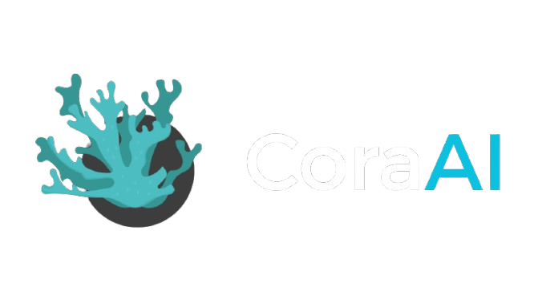

# CoraAI — Sistema Experto Taxonómico y Software Educativo de Corales (Los Roques) 🌊🪸



**CoraAI** es un **Sistema Experto Híbrido y Software Educativo** de última generación diseñado para la identificación, clasificación, conservación y análisis pedagógico-científico de especies de corales duros y fotosintéticos del orden *Scleractinia*, halladas en el **Parque Nacional Archipiélago de Los Roques, Venezuela**.

Combina la precisión y certeza de la **IA Simbólica** (Árbol de Decisión Dicotómico y Motor de Inferencia de Reglas Biológicas) con la adaptabilidad y flexibilidad de la **IA Subsimbólica** (Red Neuronal en TensorFlow/Keras + Motor de Ponderación Semántica NLP).

## 👥 Integrantes del Grupo (Grupo 8)

Desarrollado para la asignatura de **Sistemas Expertos (I2026)** en la **Universidad de Oriente**:

* **Alexander González** — *Desarrollo Backend & Algoritmos*
  - 🌐 [Portafolio Personal](https://portafolio-zeta-nine.vercel.app/)

* **Lázaro Hernánde** — *Desarrollo Frontend & Reglas Taxonómicas*
  - 🌐 [Portafolio Personal](https://my-portafolio-weld.vercel.app/)

* **Marxel Rodriguez** — *Lógica del Sistema & Investigador del proyecto*
  - 🌐 [Portafolio Personal](https://portafoliomarxel.vercel.app/)

## 📖 Descripción General y Dominio de Conocimiento

En los ecosistemas arrecifales, la identificación taxonómica de especímenes de corales *Scleractinia* a menudo requiere un conocimiento biológico profundo. Múltiples factores como la variación morfológica, la profundidad y las condiciones de la columna de agua dificultan la clasificación rápida mediante claves dicotómicas tradicionales escritas en papel, las cuales resultan rígidas e intolerantes a fallos cuando el usuario desconoce un término o comete un error impreciso.

**CoraAI** resuelve este problema actuando como un **asistente experto digital y plataforma interactiva educativa**. El sistema combina dos paradigmas clave de la Inteligencia Artificial:
1. **IA Simbólica (Rigor Cierto)**: Árbol de decisión dicotómico y reglas biológicas estrictas que garantizan certeza taxonómica.
2. **IA Subsimbólica (Flexibilidad)**: Redes neuronales profundas (TensorFlow/Keras) y procesamiento de lenguaje natural (NLP) que permiten al usuario describir especímenes con lenguaje cotidiano o impreciso.

Su utilidad abarca tanto el ámbito científico/ecológico como el **educativo**, sirviendo como herramienta pedagógica interactiva para estudiantes de ingeniería, biología y conservacionistas.

## 🚀 Estado Actual del Proyecto (Rama `Grupo8`)

- 🌐 **Interfaz Web SPA Modernizada**: Desarrollada en **React + Vite** con diseño **Liquid Glassmorphism**, estética marina bioluminiscente y tipografía *Montserrat*.
- ⚡ **Backend REST de Alta Velocidad**: Servidor unificado en **FastAPI / Uvicorn** con documentación Swagger integrada.
- 📋 **Cuestionario Dicotómico Guiado (2 Columnas)**: Preguntas paso a paso con filtrado en tiempo real del listado de candidatos en pequeñas tarjetas horizontales y tarjeta de resultado final con recuadro fotográfico `110x110px`.
- 🤖 **Diagnóstico por Lenguaje Natural con IA**: Procesamiento de descripciones con sugerencias de 1 sola línea (`+ marrón`, `+ ramificada`, etc.) y modal de **Explicabilidad Algorítmica (XAI)**.
- 🪸 **Catálogo de Especies & Gestión CRUD**: Carga procedimental por lotes con esqueletos de carga (*shimmers*), modal detallado en 2 columnas montado via `createPortal` y formulario modal de **Alta de Nueva Especie** (`POST /api/especies`) con almacenamiento de imágenes.
- 🔐 **Pantalla de Login con Diseño Liquid Glass**: Inicio de sesión con credenciales mockeadas, panel de branding animado y transición suave a la aplicación principal.

## 🏗️ Arquitectura del Sistema

### 1. Base de Conocimientos (Hechos y Reglas)
* **Registro de Hechos (`data/especies.json`)**: Contiene el perfil biológico, morfológico y fotográfico de **41+ especies** documentadas en Los Roques (formas, tipo de coralitos, crestas, valles, coloración, hábitat y zona de oleaje).
* **Reglas Taxonómicas (`data/reglas.json`)**: Reglas de inferencia codificadas en estructura de árbol dicotómico para evaluación taxonómica paso a paso.

### 2. Motor de Inferencia y Modelo Híbrido Multicriterio
* **Encadenamiento Hacia Adelante (Forward Chaining)**: El motor evalúa los atributos biológicos proporcionados para navegar los nodos del árbol dicotómico de preguntas.
* **Manejo de Incertidumbre y Fallback Semántico (`PredictorCorales`)**:
  * **Cálculo del Score Continuo**: Cuando se usa el módulo de IA, la aplicación calcula un ranking unificado Top 3/Top 5 para evitar respuestas binarias de error.
  $$\text{Score} = (\text{Coincidencia Taxonómica Red Neuronal} \times 0.5) + (\text{Similitud Física de Texto NLP} \times 0.5)$$
  * **Detección de Baja Confianza**: Si el promedio de confianza neuronal es $< 0.5$ o se detectan menos de 3 características activas, el predictor activa una búsqueda por similitud semántica (*Overlap Coefficient* lematizado), extrayendo los rasgos reales de la especie candidata para nutrir al motor simbólico.


[Entrada de Usuario: Texto o Cuestionario]
│
┌────────────────┴────────────────┐
▼                                 ▼
[Red Neuronal Keras]       [Motor Dicotómico]
(Rasgos Predichos)         (Evaluación de Reglas)
│                                 │
└────────────────┬────────────────┘
▼
[Motor Ponderación Semántica NLP]
│
▼
[Ranking Híbrido Top 3 / Top 5]


## 📂 Arquitectura General de Directorios


```

Sistemas-Experto-I2026/
├── run_server.py               # Lanzador unificado del servidor FastAPI + Producción React
├── requirements.txt            # Dependencias de Python (FastAPI, TensorFlow, Pydantic, etc.)
├── .gitignore                  # Exclusiones de control de versiones Git
├── src/                        # Núcleo del Backend en Python
│   ├── api/
│   │   ├── app.py              # Endpoints API REST (/api/cuestionario, /api/ia, /api/especies)
│   │   └── schemas.py          # Validación de entradas/salidas Pydantic v2
│   ├── motor_inferencia.py     # Motor de Inferencia Simbólico (Árbol Dicotómico)
│   ├── modelo_hibrido.py       # Red Neuronal TensorFlow/Keras & Clasificador Híbrido
│   ├── motor_ponderacion.py    # Motor de Ponderación Semántica por Atributos Morfológicos
│   ├── base_conocimiento.py    # Gestión de especies.json y reglas.json
│   ├── preguntas.py            # Generador de clave de preguntas taxonómicas
│   └── explicacion.py          # Generador de explicaciones algorítmicas (XAI)
├── frontend/                   # Aplicación Web SPA (React + Vite)
│   ├── src/
│   │   ├── assets/             # Logo oficial transparente y recursos gráficos
│   │   ├── components/         # Componentes React (Cuestionario, DiagnosticoIA, Catalogo, Modales)
│   │   │   ├── Cuestionario.jsx
│   │   │   ├── DiagnosticoIA.jsx
│   │   │   ├── CatalogoEspecies.jsx
│   │   │   ├── GuiaTaxonomica.jsx
│   │   │   ├── ModalDetalleCoral.jsx
│   │   │   ├── ModalAgregarEspecie.jsx
│   │   │   └── ModalExplicacionIA.jsx
│   │   ├── App.jsx             # Shell principal de navegación y Hero
│   │   └── index.css           # Sistema de Diseño Liquid Glassmorphism
│   ├── dist/                   # Build compilado de producción servido por FastAPI
│   └── package.json
├── data/                       # Base de datos JSON y fotografías taxonómicas
│   ├── especies.json           # Registro de las 41+ especies de Los Roques
│   ├── reglas.json             # Reglas del árbol dicotómico
│   └── Imagenes/               # Galería de imágenes de alta resolución (.jpg)
├── docs/                       # Documentación Técnica, de Usuario y Sistema Híbrido
│   ├── manual_usuario.md       # Guía detallada para el usuario final
│   ├── manual_tecnico.md       # Especificaciones técnicas de la API y componentes
│   └── funcionamiento_hibrido.md# Detalle del Motor Simbólico + Subsimbólico
└── tests/                      # Pruebas unitarias automatizadas con pytest

```

## 🛠️ Guía de Instalación y Configuración

### 1. Requisitos Previos
- **Python 3.8+**
- **Node.js 18+** y **npm** (opcional, solo para modificaciones en el frontend React)

### 2. Instalación de Dependencias
En la raíz del proyecto, ejecute:
```bash
pip install -r requirements.txt
```

### 3. Lanzar la Aplicación (Servidor Unificado)

Ejecute el script de arranque principal:

```bash
python run_server.py
```

* 🌐 **Plataforma Web (React)**: Abre [http://localhost:8000](http://localhost:8000) en tu navegador.
* 📚 **Documentación API (Swagger UI)**: Consulta [http://localhost:8000/docs](http://localhost:8000/docs).

## 🕹️ Guía de Uso del Sistema

### 🔐 Credenciales de Acceso

Al abrir la plataforma web, se mostrará una pantalla de inicio de sesión. Utilice las siguientes credenciales:

| Campo | Valor |
|---|---|
| **Usuario** | `admin` |
| **Contraseña** | `admin123` |

### Funcionalidades Principales

1. **Diagnóstico por Cuestionario Guiado**:
* Dirígete a la pestaña **Cuestionario**
* Responde consecutivamente las preguntas morfológicas (forma, coralitos, hábitat)
* Observa cómo las tarjetas de candidatos se filtran en tiempo real en la columna lateral hasta llegar a la tarjeta de resultado final

2. **Diagnóstico por IA en Lenguaje Natural**:
* Selecciona **Diagnóstico IA**.
* Escribe una descripción libre (ej. *"Coral con ramas aplanadas como paletas, marrón claro en zona de oleaje"*).
* Pulsa **Analizar**. El sistema mostrará un *stepper* animado y desplegará la recomendación ganadora (Top 3) con el modal de Explicabilidad Algorítmica (XAI)


3. **Catálogo & Gestión CRUD**:
* Explora todas las especies registradas con *shimmers* de carga y modales descriptivos a dos columnas
* Utiliza el formulario para dar de **Alta a una Nueva Especie** (`POST /api/especies`)

## 🧪 Ejemplos de Ejecución (Casos de Prueba)

A continuación se muestran diagnósticos reales generados por la integración del motor híbrido:

### 📌 Caso de Prueba 1: Estructura Ramificada Aplanada

* **Entrada**: *"Coral con ramas aplanadas como paletas, color marrón claro, zona de oleaje"*
* **Rasgos Predichos por IA**: `{p1: "ramificada", p2: "aplanadas_paletas", p5: "marrón_claro"}`
* **Diagnóstico Sugerido**: **🥇 Acropora palmata** *(Coral Cuerno de Alce)* — **Confianza: 92.40%**

### 📌 Caso de Prueba 2: Estructura Masiva en Forma de Cerebro

* **Entrada**: *"Coral grande redondo con surcos profundos como cerebro, color gris, zona profunda"*
* **Rasgos Predichos por IA**: `{p19: "masiva", p30: "valles", p31: "surcos_profundos"}`
* **Diagnóstico Sugerido**: **🥇 Diploria labyrinthiformis** *(Coral Cerebro)* — **Confianza: 67.15%**

### 📌 Caso de Prueba 3: Estructura Foliosa o Laminar

* **Entrada**: *"Coral en forma de hoja o placa delgada, color marrón claro, poca luz"*
* **Rasgos Predichos por IA**: `{p1: "laminar_hoja", p5: "marrón_claro"}`
* **Diagnóstico Sugerido**: **🥇 Agaricia agaricites** *(Coral Lechuga)* — **Confianza: 84.10%**

## 🧪 Pruebas Unitarias Automatizadas

Para validar los motores de inferencia, reglas y endpoints de la API, ejecute:

```bash
pytest
```

## 💡 Conclusiones y Trabajo Futuro

### Reflexiones del Desarrollo

* **Superación de la Rigidez Simbólica**: La principal dificultad radicaba en que las claves dicotómicas tradicionales fallan si el usuario desconoce un solo término
La combinación con **Keras + Ponderación Semántica** resolvió esto permitiendo calcular probabilidades continuas sin tantos enredos para el usuario

* **Opiniones durante el semestre**: Sin dudas entrar en un mundo nuevo cada dia es algo que en el inicio, lo vimos con dificultad, sin embargo, al paso de semanas, al paso de cada investigacion y documento con el que nos ibamos nutriendo, nos dimos cuenta, que un tema en el que al inicio del todo, desconociamos en su totalidad, era un mundo lleno de tantas especies increibles como fascinantes, sin dudas, si, atravesar el mundo de los corales fue toda una locura, lo sabemos, sin embargo, fue una locura que al final del dia, luego de todo lo que pasamo, ya sea programando, disenando o organizando la informacion, fue un trabajo que nos ayudo para tranajar en equipo y ademas de adentrarnos en el mundo de los corales, fue el fin de participar en la realizacion de un sistema especializado para una zona de nuestra isla en el ambito de los corales

* **Optimización Morfológica**: Se enriqueció el *dataset* con sinónimos de formas masivas y surcos sinuosos para evitar confusiones en especies del género *Diploria* y *Pseudodiploria*

### Trabajo Futuro

1. **Visión por Computador (CNN)**: Integrar redes neuronales convolucionales para clasificación directa mediante fotos tomadas por buzos en tiempo real

2. **Aplicación Móvil Offline (PWA)**: Permitir la ejecución local de las reglas en dispositivos móviles sin necesidad de conexión a internet en alta mar

3. **Módulo de Salud Arrecifal**: Incorporar diagnóstico de enfermedades comunes (blanqueamiento coralino, enfermedad de banda negra/blanca)

## 📚 Referencias Bibliográficas

* **Alcolado, P. M. (2004)**. *Manual de capacitación para el monitoreo voluntario de alerta temprana en arrecifes coralinos*. Ministerio de Ciencia, Tecnología y Medio Ambiente; Instituto de Oceanología.
* **Alcolado, P. M. (2014)**. Conocimientos básicos para un monitoreo voluntario rápido de alerta temprana en arrecifes coralinos. En A. C. Hernández-Zanuy & P. M. Alcolado (Eds.), *Métodos para el estudio de la biodiversidad en ecosistemas marinos tropicales de Iberoamérica para la adaptación al cambio climático* (pp. 122-185). Instituto de Oceanología.
* **Pérez-Castresana, G., Villamizar, E., Varela, R., & Fuentes, Y. (2014)**. Descripción preliminar del fitoplancton en seis arrecifes coralinos del Parque Nacional Archipiélago de Los Roques. *Acta Biológica Venezuelica*, 34(2), 293-309.
* **Prieto, M. A. (1972)**. *Los arrecifes coralinos del atolón Los Roques*. Centro Submarinista CESUSIBO; Universidad Simón Bolívar; Universidad Central de Venezuela.
* **Villamizar, E., Yranzo, A., González, M., Herrera, A. T., Pérez, J., & Camissotti, H. (2014)**. Diversidad y condición de salud de corales pétreos en algunos arrecifes del Parque Nacional Archipiélago Los Roques, Venezuela. *Acta Biológica Venezuelica*, 34(2), 257-279.

### Como plus: portafolio personales de cada estudiante se encontraran de manera directa en el codigo con botones que le enviaran al deseado por usted

