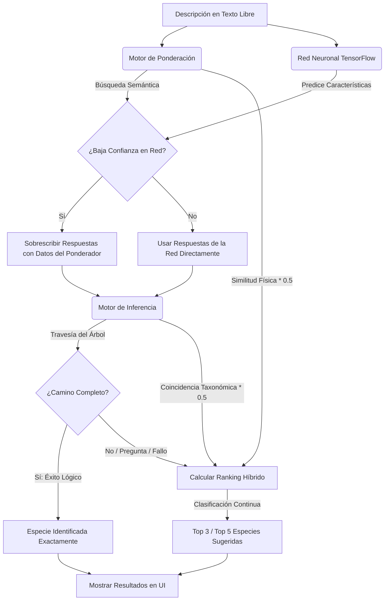

# Arquitectura Coexistente del Sistema Experto Híbrido 🪸🧠

Este documento describe en detalle el funcionamiento del sistema experto híbrido de identificación de corales para el Parque Nacional Archipiélago de Los Roques. En este diseño coexistente, la Inteligencia Artificial (Red Neuronal) y los sistemas basados en reglas y lógica formal (Árbol de Decisiones, Motor de Inferencia y Motor de Ponderación) cooperan mutuamente para ofrecer diagnósticos robustos, interpretables y tolerantes a la ambigüedad.

---

## 1. Los Componentes del Sistema

El sistema está compuesto por cuatro pilares fundamentales que representan enfoques de IA Simbólica (basada en reglas) e IA Subsimbólica (conexión/redes neuronales):

### A. La Red Neuronal Artificial (Deep Learning)
* **Archivo principal**: [modelo_hibrido.py](file:///c:/Users/Pc01/Desktop/Lazaro/Sistemas%20expertos/Sistemas-Experto-I2026/src/modelo_hibrido.py)
* **Tecnología**: Red Neuronal Secuencial multicapa entrenada con TensorFlow/Keras.
* **Propósito**: Actuar como un **traductor de lenguaje natural**. La red no predice la especie directamente (lo cual sería propenso a fallar ante descripciones raras), sino que predice las **características taxonómicas** (los atributos del cuestionario como: forma, textura, presencia de coralitos, etc.) que se deducen a partir de la descripción textual libre escrita por el usuario.

### B. El Árbol de Decisiones Taxonómicas
* **Archivo principal**: [reglas.json](file:///c:/Users/Pc01/Desktop/Lazaro/Sistemas%20expertos/Sistemas-Experto-I2026/data/reglas.json)
* **Propósito**: Es el mapa formal del conocimiento científico botánico/zoológico. Representa la clave dicotómica estructurada en la que las preguntas (nodos intermedios) conducen a través de bifurcaciones (opciones) a especies clasificadas (nodos hoja).

### C. El Motor de Inferencia (IA Simbólica)
* **Archivo principal**: [motor_inferencia.py](file:///c:/Users/Pc01/Desktop/Lazaro/Sistemas%20expertos/Sistemas-Experto-I2026/src/motor_inferencia.py)
* **Propósito**: Ejecutar el razonamiento lógico formal sobre el árbol de decisiones. Recibe un conjunto de características estructuradas (hechos) y recorre el árbol. Su comportamiento es riguroso:
  - **Éxito**: Si las características permiten completar un camino unívoco del árbol de decisiones.
  - **Pregunta**: Si falta alguna característica para poder decidir por qué rama continuar.
  - **Fallo**: Si las respuestas entran en contradicción científica o violan las reglas del árbol.

### D. El Motor de Ponderación Inteligente
* **Archivo principal**: [motor_ponderacion.py](file:///c:/Users/Pc01/Desktop/Lazaro/Sistemas%20expertos/Sistemas-Experto-I2026/src/motor_ponderacion.py)
* **Propósito**: Evaluar la similitud textual y semántica directa. Analiza la descripción libre en busca de términos específicos (colores, formas, microestructuras, hábitats) usando normalización y sinónimos biológicos/coloquiales. Asigna puntos a cada especie registrada en [especies.json](file:///c:/Users/Pc01/Desktop/Lazaro/Sistemas%20expertos/Sistemas-Experto-I2026/data/especies.json) basándose en pesos diferenciados por categoría (ej. coincidir en una microestructura aporta `2.0` puntos, mientras que coincidir en color aporta `0.4` puntos).

---

## 2. Flujo de Coexistencia Mutua (Cómo Cooperan)

En lugar de trabajar de forma aislada, estos cuatro módulos se integran en un pipeline híbrido cuando el usuario realiza un diagnóstico mediante texto libre:

### Detalle Paso a Paso:

1. **Recepción del Texto**: El usuario introduce una descripción, por ejemplo:
   > *"Coral con ramas aplanadas como paletas, de color marrón claro, en zona de oleaje somera."*
   
2. **Procesamiento Paralelo**:
   - **La Red Neuronal** procesa el texto a través de su tokenizador y predice las variables taxonómicas correspondientes. Por ejemplo, activa `p1 = si` (tiene coralitos), `p6 = ramificado`, `p11 = abanico`.
   - **El Motor de Ponderación** analiza el texto buscando tokens y sinónimos para generar un ranking preliminar basado en la base de datos de especies reales.

3. **Integración Semántica (Salvaguarda de Baja Confianza)**:
   - Si la Red Neuronal produce predicciones con baja confianza (menos de 3 características activas o confianza promedio menor al 50%), el sistema utiliza la especie con mejor puntuación del **Motor de Ponderación** para extraer sus características biológicas reales y fusionarlas ("parchear") con las de la Red Neuronal. Esto evita que la Red Neuronal desvíe el diagnóstico debido a una redacción inusual del usuario.

4. **Razonamiento a través del Motor de Inferencia**:
   - El conjunto fusionado de características se entrega al **Motor de Inferencia**, el cual intenta navegar por el **Árbol de Decisiones Taxonómicas**.
   - Si el Motor de Inferencia alcanza un nodo hoja (un diagnóstico exacto con 100% de consistencia botánica), la especie ganadora se corona como el resultado exacto.

5. **Cálculo del Ranking Híbrido Multicriterio (Tolerancia a Fallos)**:
   - Dado que el lenguaje humano es impreciso y el árbol de decisiones es rígido (una sola discrepancia lógica detiene la inferencia), el sistema calcula un **Score Continuo de Coexistencia** para cada especie:
     $$\text{Score Final} = (\text{Coincidencia Taxonómica del Motor} \times 0.5) + (\text{Similitud Física del Ponderador} \times 0.5)$$
   - Este score combina la precisión científica del Motor de Inferencia con la flexibilidad semántica del Motor de Ponderación.
   - En lugar de arrojar un error de "Fallo en la inferencia", la interfaz presenta un **Top 3 de Especies Sugeridas** con sus respectivos porcentajes de coincidencia, indicando visualmente qué características de la descripción coinciden y cuáles no para cada especie candidata.

---

## 3. Ventajas de este Enfoque Coexistente

> [!TIP]
> **Explicabilidad Humana**: A diferencia de los modelos de Deep Learning tipo "caja negra", el sistema puede detallar exactamente qué reglas del árbol se cumplieron y qué términos del texto libre justifican el ranking de cada especie.

> [!IMPORTANT]
> **Resiliencia Biológica**: Un coral real puede mostrar ligeras variaciones de color o tamaño debido a factores ambientales. La coexistencia del motor de ponderación (que castiga poco las discrepancias secundarias) y la red neuronal (que abstrae conceptos) evita que estas variaciones rompan el diagnóstico.

> [!NOTE]
> **Interactividad**: Si la inferencia se detiene a mitad del árbol debido a la falta de información, el sistema es capaz de sugerir la siguiente pregunta lógica más relevante para continuar el diagnóstico paso a paso.
